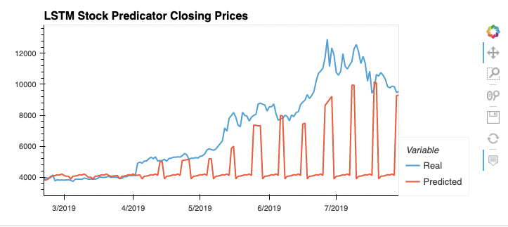
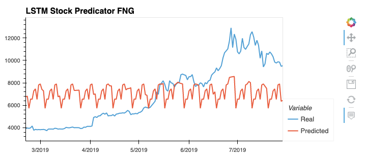

# LSTM-Stock-Predictor

Due to the volatility of cryptocurrency speculation, investors will often try to incorporate sentiment from social media and news articles to help guide their trading strategies. One such indicator is the Crypto Fear and Greed Index (FNG) which attempts to use a variety of data sources to produce a daily FNG value for cryptocurrency. You have been asked to help build and evaluate deep learning models using both the FNG values and simple closing prices to determine if the FNG indicator provides a better signal for cryptocurrencies than the normal closing price data.

In this assignment, you will use deep learning recurrent neural networks to model bitcoin closing prices. One model will use the FNG indicators to predict the closing price while the second model will use a window of closing prices to predict the nth closing price.

You will need to:

1. Prepare the data for training and testing
2. Build and train custom LSTM RNNs
3. Evaluate the performance of each model

- - -

## Instructions

### 1. Prepare the data for training and testing

In this section, I have used the starter code as a guide to create a Jupyter Notebook for each RNN. 

I used the FNG values to try and predict the closing price and used the previous closing prices to try and predict the next closing price as well. 

In each model, I used 70% of the data for training and 30% of the data for testing.

Then, I applied a MinMaxScaler to the X and y values to scale the data for each model.

Finally, I have reshaped the X_train and X_test values to fit the model's requirement of samples, time steps, and features.

### 2. Build and train custom LSTM RNNs

In each Jupyter Notebook, I created the same custom LSTM RNN architecture. But I have fitted the data using the FNG values in one notebook and in the second notebook, I have fitted the data using only closing prices.

I used the same parameters and training steps for each model to compare each model accurately.

### 3. Evaluate the performance of each model

Finally, I used the testing data to evaluate each model and compare their performances.

> Which model has a lower loss?
Comparing both the models evaluation, we can see that the stock predictor using the closing price had the lower loss. 
The loss for the closing price predictor was 0.022, and the fng predictor had a loss of 0.091.

> Which model tracks the actual values better over time?
Both models don't seen to track the best actual values, so will need further analysis in order to use any of these models as predictor.

> Which window size works best for the model?
For both models a window of 10 worked best, however the closing predictor was better at predicting the 1 day window.

  

